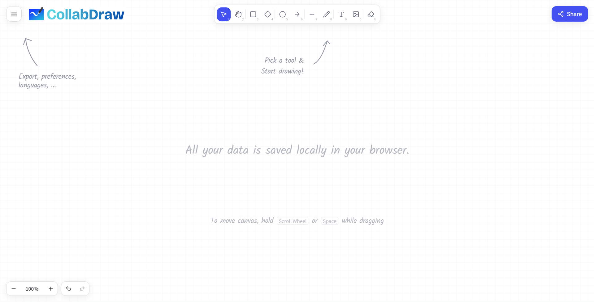

# 


CollabDraw is a powerful, real-time collaborative whiteboard application designed for seamless teamwork and brainstorming. It features an infinite canvas, a variety of drawing tools, and instant synchronization across connected users, making it ideal for remote teams, educators, and designers.




## ✨ Features

- **Infinite Canvas**: A boundless workspace that allows you to pan and zoom freely, giving you all the space you need for your ideas.
- **Real-Time Collaboration**: Share your session with others and see changes instantly as they happen. Powered by a robust WebSocket backend.
- **Rich Toolset**:
  - **Shapes**: Rectangle, Diamond, Ellipse.
  - **Lines & Arrows**: Connect ideas with smooth lines and directed arrows.
  - **Freehand Drawing**: Sketch naturally with the pencil tool.
  - **Text**: Add labels and notes anywhere on the canvas.
  - **Images**: Import images directly onto the board.
- **Customization**:
  - **Themes**: Fully supported Light, Dark, and System color modes.
  - **Styles**: Adjust stroke width, colors, fill patterns (hachure, cross-hatch, dots, etc.), and stroke styles (solid, dashed, dotted).
- **Export & Import**:
  - Save your work as a `.json` file to pick up later.
  - Export your canvas as an image (PNG) for easy sharing.
- **Local-First**: Your data is saved locally in your browser by default, ensuring you never lose work even without a server connection.

## 🛠 Tech Stack

### Frontend
Built with a modern, performance-focused stack:
- **[React](https://react.dev/)**: For building a dynamic user interface.
- **[Vite](https://vitejs.dev/)**: For lightning-fast development and building.
- **[TypeScript](https://www.typescriptlang.org/)**: Ensuring type safety and code quality.
- **[Tailwind CSS](https://tailwindcss.com/)**: For rapid, utility-first styling.
- **[Shadcn UI](https://ui.shadcn.com/)** & **[Radix UI](https://www.radix-ui.com/)**: For accessible, high-quality UI components.
- **[Framer Motion](https://www.framer.com/motion/)**: For smooth, declarative animations.

### Backend
A lightweight, high-performance WebSocket server:
- **[Bun](https://bun.sh/)**: A fast all-in-one JavaScript runtime.
- **[ws](https://github.com/websockets/ws)**: A simple and efficient WebSocket implementation.

## 🚀 Getting Started

Follow these steps to get the project running locally.

### Prerequisites
- **Node.js** & **npm** (for the frontend).
- **Bun** (for the backend).

### 1. Backend Setup (Collaborative Server)
The backend is required for the "Live Collaboration" feature.

1. Navigate to the backend directory:
   ```bash
   cd backend
   ```
2. Install dependencies:
   ```bash
   bun install
   ```
3. Start the server:
   ```bash
   bun run dev
   ```
   The WebSocket server will start on `ws://localhost:8080`.

### 2. Frontend Setup
1. Navigate to the project root directory:
   ```bash
   cd ..
   # or if starting from root
   # cd CollabDraw
   ```
2. Install dependencies:
   ```bash
   npm install
   ```
3. Start the development server:
   ```bash
   npm run dev
   ```
4. Open your browser and navigate to the URL shown (usually `http://localhost:5173`).

## 🤝 Usage

- **Drawing**: Select a tool from the toolbar (top center) and click/drag on the canvas.
- **Moving**: Hold `Space` or the middle mouse button to pan around the canvas.
- **Zooming**: Use `Ctrl` + Scroll or pinch gestures to zoom in and out.
- **Selection**: Use the cursor tool to click or drag a marquee to select elements. You can move, resize, or delete them.
- **Collaboration**: Click the "Menu" icon (top left) and select "Live collaboration..." to start a session.

## 📂 Project Structure

- **`src`**: Main frontend source code.
  - **`components/whiteboard`**: Core whiteboard components (Canvas, Toolbar, etc.).
  - **`hooks`**: Custom React hooks (e.g., `useTheme`).
  - **`types`**: TypeScript type definitions.
- **`backend`**: WebSocket server code.
  - **`index.ts`**: Main server entry point handling room logic and message broadcasting.
